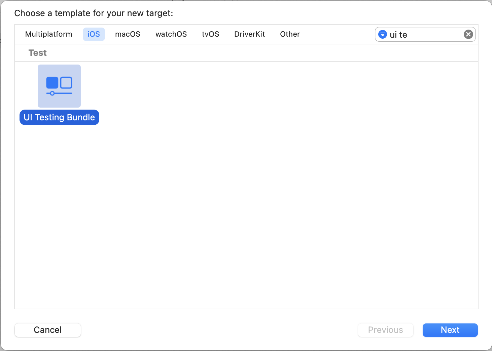
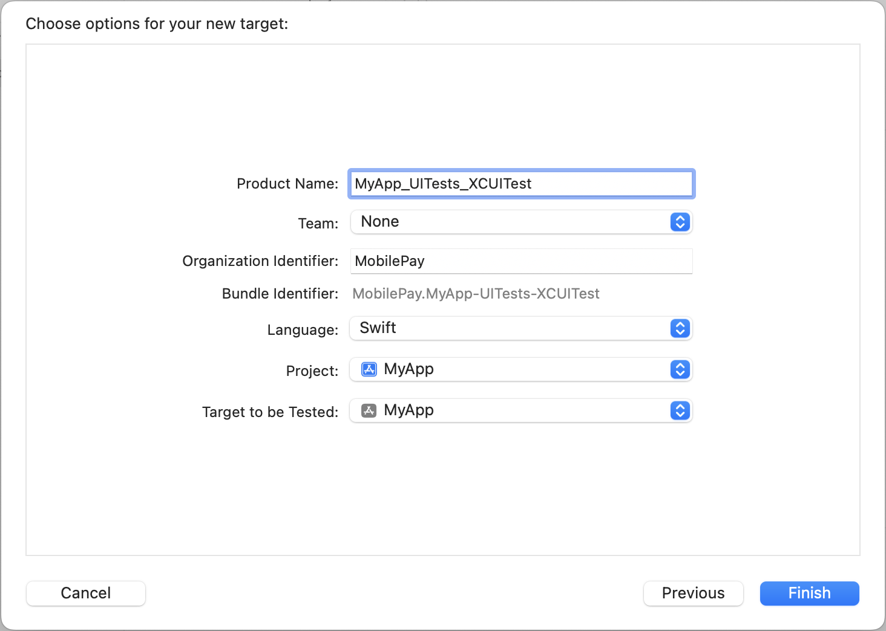
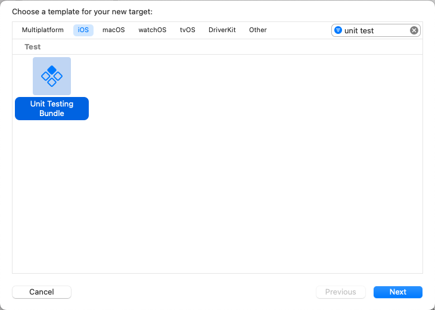
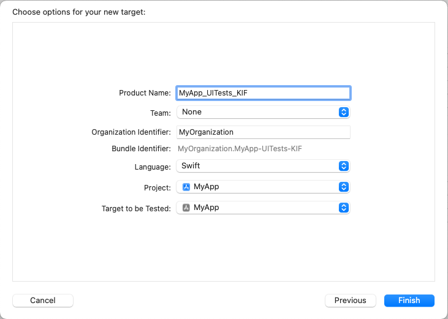
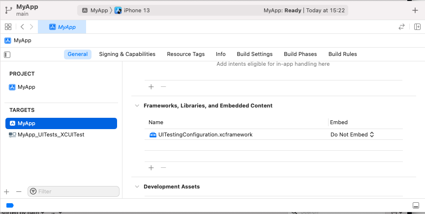
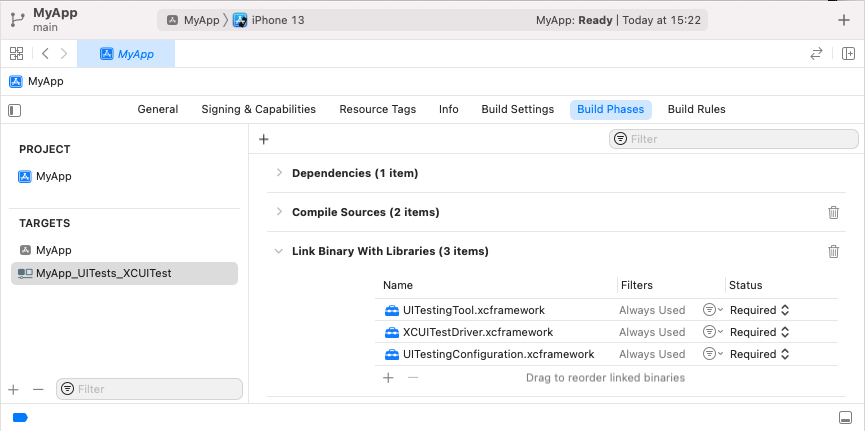
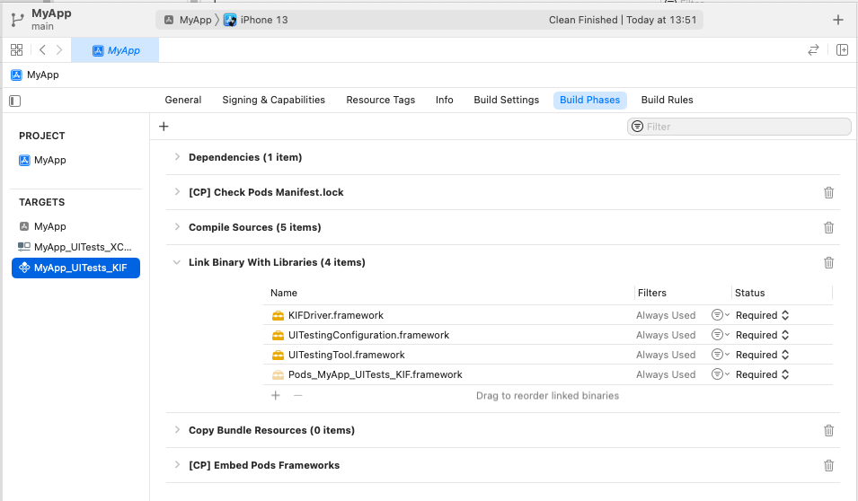
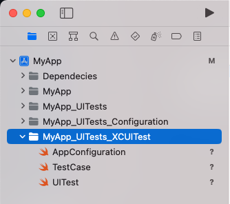

# Install and run

This document shows you how to install UITestingTool and then how to set up and run your first
test.

- [Install](#install)
    + [Step 0 (XCUITest): Create "UI Testing Bundle" target](#step-0--xcuitest---create--ui-testing-bundle--target)
    + [Step 0 (KIF): Create "Unit Testing Bundle" target](#step-0--kif---create--unit-testing-bundle--target)
  * [Swift Package Manager Installation](#swift-package-manager-installation)
  * [Carthage Installation](#carthage-installation)
    + [Step 1: Install dependencies via Carthage](#step-1--install-dependencies-via-carthage)
    + [Step 2: Add dependencies to the project](#step-2--add-dependencies-to-the-project)
  * [GitHub Installation](#github-installation)
    + [Step 1: Download project](#step-1--download-project)
    + [Step 2: Add UITestingTool as subproject](#step-2--add-uitestingtool-as-subproject)
    + [Step 3: Link dependencies to targets](#step-3--link-dependencies-to-targets)
- [Set Up and run your first test](#set-up-and-run-your-first-test)
    + [Step 1: Setup UI tests execution target](#step-1--setup-ui-tests-execution-target)
    + [Step 2: Setup simple UI for testing](#step-2--setup-simple-ui-for-testing)
    + [Step 3: First UI test](#step-3--first-ui-test)
    + [Step 4: Setup configuration injection](#step-4--setup-configuration-injection)
    + [Step 5: Apply first configuration](#step-5--apply-first-configuration)

## Install

You can add UITestingTool to Xcode projects in three ways: using [SPM](#swift-package-manager-installation), [Carthage](#carthage-installation) or [Manually](#github-installation) through the Xcode Project.

#### Step 0 (XCUITest): Create "UI Testing Bundle" target

Creating UI tests excution target





#### Step 0 (KIF): Create "Unit Testing Bundle" target

Creating unit tests excution target. **KIF runs via Unit tests target!**





### Swift Package Manager Installation

- [ ] TODO: Add support and instructions for SPM

### Carthage Installation

#### Step 1: Install dependencies via Carthage

- Add dependency entry to Cartfile `github "MobilePayDev/UITestingTool.git" "main"` which will point to latest version.
- Install dependencies via Carthage `carthage update --use-xcframeworks` it will create 3 frameworks: `UITestingConfiguration`, `UITestingTool` and `XCUITestDriver`.

#### Step 2: Add dependencies to the project

- Drag `UITestingConfiguration` to your project and link to:
    - `YourApp` target
    - `YourApp_UITests_XCUITest` target
    - `YourApp_UITests_KIF` target
- Drag `UITestingTool` to your project and link to:
    - `YourApp_UITests_XCUITest` target
    - `YourApp_UITests_KIF` target
- Drag `XCUITestDriver` to your project and link to:
    - `YourApp_UITests_XCUITest` target
- Drag `KIFDriver` to your project and link to:
    - `YourApp_UITests_KIF` target

For `YourApp_UITests_KIF` add KIF framework in your prefered way (follow instructions in [KIF repo](https://github.com/kif-framework/KIF) )

In the end you should have:







### GitHub Installation

#### Step 1: Download project

You need physical copy of UITestingTool source. There are several ways how you can get it, choose one based on your needs.
- (Git submodule) Add as git submodule to YourApp git repo
- (Git subtree) Add as git subtree to YourApp git repo
- (Manual) Download copy from GitHub

#### Step 2: Add UITestingTool as subproject

Drag in UITestingTool project to your Xcode project or workspace. After doing that you will have visibility of needed targets.

#### Step 3: Link dependencies to targets

- Link `UITestingConfiguration` to:
    - `YourApp` target
    - `YourApp_UITests_XCUITest` target
    - `YourApp_UITests_KIF` target
- Link `UITestingTool` to:
    - `YourApp_UITests_XCUITest` target
    - `YourApp_UITests_KIF` target
- Link `XCUITestDriver` to:
    - `YourApp_UITests_XCUITest` target
- Link `KIFDriver` to:
    - `YourApp_UITests_KIF` target

For `YourApp_UITests_KIF` add KIF framework in your prefered way (follow instructions in [KIF repo](https://github.com/kif-framework/KIF) )
    
In the end you should have:


## Set Up and run your first test

#### Step 1: Setup UI tests execution target

Remove default generated tests from `YourApp_UITests_XCUITest` target.

`YourApp_UITests_XCUITest` needs to be setupped to execute agnostic UI tests, that is done by copying 3 template files from `UITestingTool/templates/XCUITest_Target` and adding them to `YourApp_UITests_XCUITest` target.

 

#### Step 2: Setup simple UI for testing

Create UIButton on main screen of your app with accessibility ID `button_1` and title `Click me`.

#### Step 3: First UI test

Create `YourApp_UITests` folder, this folder will hold all your tests. Tests under this folder can be added to multiple UI tests execution targets (`YourApp_UITests_XCUITest`, `YourApp_UITests_KIF`, etc).

Create your first test `MyFirstUITests.swift` under `YourApp_UITests` folder .

```swift
final class MyFirstUITests: TestCase {
    
    func test_home_screen_button_WHEN_app_launch_THEN_button_is_visible_AND_correct_text() {
        AppConfiguration(self)
            <~ Inject()
        
        UITest(self)
            .button(accessibilityId: "button_1")
            .assert(visibility: .sufficientlyVisible)
            .assert(text: "Click me")
    }
}
```

#### Step 4: Setup configuration injection

Configurations are injected in UI tests, but they executed on app target. App target is not directly aware of configuration and configuration execution worker so explicit mapping needs to be provided.
    
Registration of configuration and worker pairs and applying configurations that are passed from UI tests:

```swift
import Foundation
import UITestingConfiguration

struct TestingSetup {
    
    static var isTesting: Bool {
        ProcessInfo.processInfo.arguments.contains("-UI_TESTING")
    }
    
    static func setupForTesting() {
        // Explicitly adding mapping of configurations and workers that can execute those configurations
        let configurations = UITestingConfiguration(map: [
            // (MyConfiguration.self, MyConfigurationWorker.self)
        ])
        // Applying/executing configurations that was passed from UI tests via `ProcessInfo.processInfo.environment`
        configurations.apply()
    }
}
```

Adding testing setup in AppDelegate or other app launch place to branch to testing setup or regular setup

```swift
func application(_ application: UIApplication, didFinishLaunchingWithOptions launchOptions: [UIApplication.LaunchOptionsKey: Any]?) -> Bool {
    
    if TestingSetup.isTesting {
        TestingSetup.setupForTesting()
    } else {
        // Regular app run setup
    }
    
    return true
}
```

#### Step 5: Apply first configuration

Create `YourApp_UITests_Configuration` folder which will hold different configurations that will be executed in app.

Create `ButtonConfiguration.swift` and add it to app target and tests target.

```swift
import UITestingConfiguration

struct ButtonConfiguration: Configuration {
    let isCountingClicks: Bool
}

```

Create `ButtonConfigurationWorker.swift` and add it only to app target. Worker will be responsible for executing configuration on app process and will contain app specific code.

```swift
import UITestingConfiguration

struct ButtonConfigurationWorker: ConfigurationWorker {
    init() {}
    
    func execute(_ configuration: Configuration) throws {
        let configuration = configuration as! ButtonConfiguration
        
        // Custom logic to setup button for counting behaviour via a global toggle
        ButtonBehaviour.isCountingEnabled = configuration.isCountingClicks
    }
}
```

Add configuration and worker mapping on app side

```swift
import Foundation
import UITestingConfiguration

struct TestingSetup {
    
    static var isTesting: Bool {
        ProcessInfo.processInfo.arguments.contains("-UI_TESTING")
    }
    
    static func setupForTesting() {
        // Explicitly adding mapping of configurations and workers that can execute those configurations
        let configurations = UITestingConfiguration(map: [
            (ButtonConfiguration.self, ButtonConfigurationWorker.self)
        ])
        // Applying/executing configurations that was passed from UI tests via `ProcessInfo.processInfo.environment`
        configurations.apply()
    }
}
```

Add test case that injects button configuration.

```swift
final class MyFirstUITests: TestCase {
    
    func test_home_screen_button_tap_WHEN_taps_not_counted_THEN_correct_text() {
        AppConfiguration(self)
            <~ ButtonConfiguration(isCountingClicks: false)
            <~ Inject()
        
        UITest(self)
            .button(accessibilityId: "button_1")
            .assert(visibility: .sufficientlyVisible)
            .assert(text: "Click me")
            .tap()
            .assert(text: "Click me")
    }
    
    func test_home_screen_button_tap_WHEN_taps_are_counted_THEN_correct_text() {
        AppConfiguration(self)
            <~ ButtonConfiguration(isCountingClicks: true)
            <~ Inject()
        
        UITest(self)
            .button(accessibilityId: "button_1")
            .assert(visibility: .sufficientlyVisible)
            .assert(text: "Click me")
            .tap()
            .assert(text: "Click me 1")
    }
}
```

#### Extra: Additional files that were used

```swift
final class ButtonBehaviour {    
    static var isCountingEnabled: Bool = false
}
```

```swift
import UIKit

final class CustomButton: UIButton {
    
    private let title = "Click me"
    private var count = 0
    
    override init(frame: CGRect) {
        super.init(frame: frame)
        setup()
    }
    
    required init?(coder: NSCoder) {
        super.init(coder: coder)
        setup()
    }
    
    private func setup() {
        accessibilityIdentifier = "button_1"
        setTitle(title, for: .normal)
        addTarget(self, action: #selector(didTap), for: .touchUpInside)
    }
    
    @objc private func didTap() {
        if ButtonBehaviour.isCountingEnabled {
            count += 1
            setTitle("\(title) \(count)", for: .normal)
        }
    }
}
```
